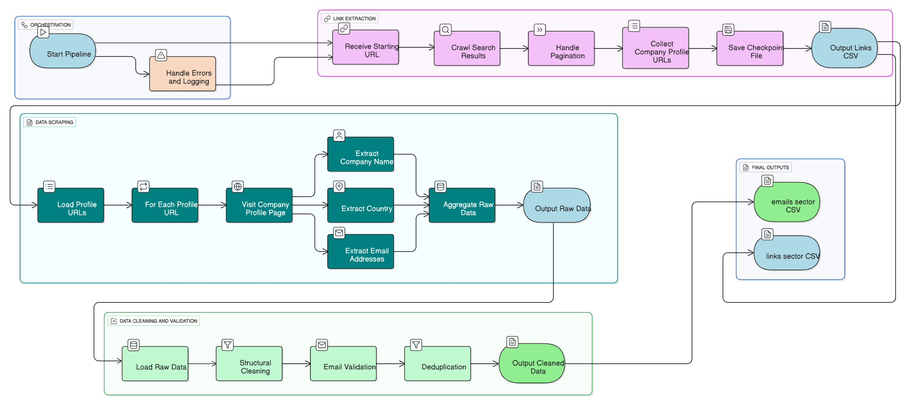

# Web Scraping Pipeline

A modular, configurable, and robust pipeline for generating lead databases from business directories. Initially configured to scrape winery data from Europages as a demonstration of its capabilities.

## 🚀 Features

- **Modular Architecture:** Separated into independent components (Link Extraction, Scraping, Data Cleaning) for easy maintenance and testing.
- **Configuration-Driven:** Easily adaptable to new sectors or websites by simply editing a YAML config file—no code changes required.
- **Resilient by Design:** Features checkpointing to save progress, allowing the pipeline to resume from the point of failure.
- **Data Quality Focus:** Includes comprehensive email validation and data cleaning to ensure high-quality output.
- **Professional Logging:** Detailed logging for monitoring progress and simplifying debugging.

## 🏗️ System Architecture

The pipeline is built with scalability and reliability in mind, consisting of three core modules managed by a central orchestrator.




## 📁 Project Structure

```
web-scraping-pipeline/
├── config/
│   ├── sectors.yaml       # For Europages
│   └── yellowpages-uae.yaml # For Yellow Pages
├── data/
│   ├── raw/               # Checkpoint files (e.g., profiles_wine.csv)
│   └── processed/         # Final outputs (e.g., emails_wine.csv)
├── logs/                  # Runtime logs for debugging and monitoring
├── src/
│   ├── link_extractor.py  # Module: paginate & extract profile URLs (Europages)
│   ├── yellowpage_extractor.py # Module: paginate & extract profile URLs (Yellow Pages)
│   ├── email_scraper.py   # Module: scrape contact info from profiles
│   ├── data_cleaner.py    # Module: validate and clean extracted data
│   ├── main.py            # Orchestrator: ties all modules together
│   └── utils/
│       ├── logger.py      # Centralized logging setup
├── tests/                 # Unit tests for modules
├── .gitignore
├── requirements.txt
└── README.md
```

## 🛠️ Installation & Usage

1.  **Clone the repository:**
    ```bash
    git clone https://github.com/shaizalyasin/web-scraping-pipeline.git
    cd web-scraping-pipeline
    ```

2.  **Install dependencies:**
    ```bash
    pip install -r requirements.txt
    ```

3.  **Configure your target sector:**
    Edit `config/sectors.yaml` or `config/yellowpages-uae.yaml` to define the search URL, pagination rules, and CSS selectors for the website you want to scrape.

4.  **Run the pipeline:**
    ```bash
    python main.py
    ```
    - **To scrape Europages:**
    ```bash
    python main.py --sector europages_wine
    ```
    
    - **To scrape Yellow Pages UAE:**
        You must provide the --category argument.
    ```bash
    python main.py --sector yellowpages_uae --category event-management
    ```
    
    You can add **--skip-emails** to either command if you only want to extract profile links and websites.
    ```bash
    python main.py --sector yellowpages_uae --category event-management --skip-emails
    ```
    Intermediate results (profile links) are stored in data/raw/, and final cleaned emails in data/processed/.    

## ⚙️ Configuration

The pipeline is driven by YAML configs `config/sectors.yaml` to keep the code generic.
This makes it easy to extend to new business directories or industries by updating selectors and URLs.

**Example:**
```yaml
yellowpages_uae:
  base_url: "https://www.yellowpages-uae.com"
  max_pages: 5
  email:
    crawl_paths:
      - "/"
      - "/contact"
      - "/contact-us"
    max_pages_per_site: 3
    ignore_domains:
      - "yellowpages-uae.com"
      - "google.com"
```

## 🤖 ML/LLM Improvements

The pipeline can be extended with intelligent features to handling data inconsistency, adapting to website changes, 
and improving data quality:

- **Data Extraction & Classification:** Use NLP models to automatically categorize and filter extracted content. This allows you to distinguish a relevant 
business email from a generic support email.
- **Scraper Resilience:** Use machine learning to automatically adapt to minor website layout changes. Instead of  fixed CSS 
selectors, a model can be trained to recognize the visual patterns of a company profile,  reducing maintenance and preventing scraper breakage.
- **Deduplication:** Use ML-based entity matching to identify and merge duplicate company records. This is more effective than simple 
text matching because it can account for variations in company names (e.g., "Mu2creations" vs. "Mu2 Creations") and other attributes.