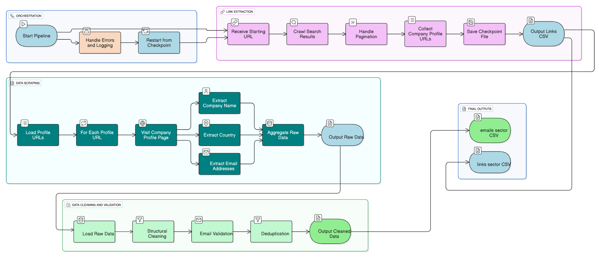

# Web Scraping Pipeline

A modular, configurable, and robust pipeline for generating lead databases from business directories. Initially configured to scrape winery data from Europages as a demonstration of its capabilities.

## 🚀 Features

- **Modular Architecture:** Separated into independent components (Link Extraction, Scraping, Data Cleaning) for easy maintenance and testing.
- **Configuration-Driven:** Easily adaptable to new sectors or websites by simply editing a YAML config file—no code changes required.
- **Resilient by Design:** Features checkpointing to save progress, allowing the pipeline to resume from the point of failure.
- **Data Quality Focus:** Includes comprehensive email validation and data cleaning to ensure high-quality output.
- **Professional Logging:** Detailed logging for monitoring progress and simplifying debugging.

## 🏗️ System Architecture

The pipeline is built with scalability and reliability in mind, consisting of four core modules managed by a central orchestrator.




## 📁 Project Structure

```
web-scraping-pipeline/
├── config/
│ ├── sectors.yaml # Sector-specific parameters and CSS selectors
├── data/
│ ├── raw/ # For checkpoint files (e.g., links_wine.csv)
│ └── processed/ # For final output (e.g., emails_wine.csv)
├── logs/ # Runtime logs for debugging and monitoring
├── src/ # Core source code
│ ├── link_extractor.py # Module to paginate and extract profile URLs
│ ├── email_scraper.py # Module to scrape contact info from profiles
│ ├── data_cleaner.py # Module to validate and clean extracted data
│ └── utils/
│ └── logger.py # Centralized logging setup
├── .gitignore
├── requirements.txt
└── README.md
```

## 🛠️ Installation & Usage

1.  **Clone the repository:**
    ```bash
    git clone https://github.com/shaizalyasin/web-scraping-pipeline.git
    cd web-scraping-pipeline
    ```

2.  **Install dependencies:**
    ```bash
    pip install -r requirements.txt
    ```

3.  **Configure your target sector:**
    Edit `config/sectors.yaml` to define the search URL, pagination rules, and CSS selectors for the website you want to scrape.

4.  **Run the pipeline:**
    ```bash
    python main.py
    ```

## ⚙️ Configuration

The heart of this project is the `config/sectors.yaml` file. It allows you to define new scraping targets without touching the code.

```yaml
europages_wine:
  source: "europages"
  base_url: "https://www.europages.co.uk"
  search_url: "https://www.europages.co.uk/companies/wine.html"
  max_pages: 5
  selectors:
    pagination: "a[aria-label='Next page']"
    profile_links: "a[href*='/companies/']"
    company_name: "h1"
    country: "span.country"